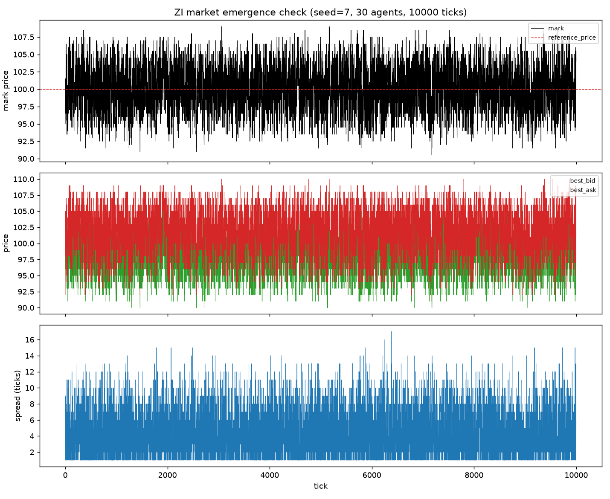
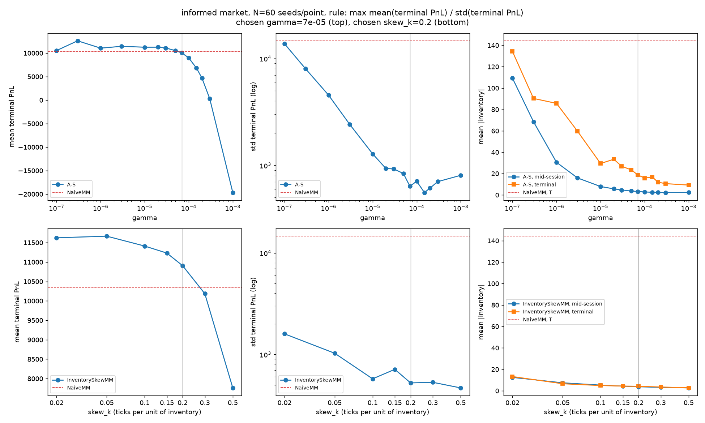
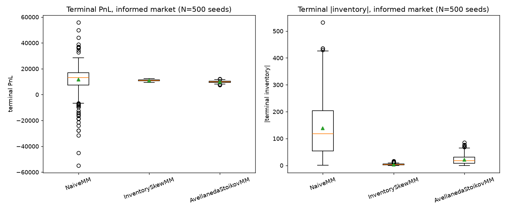
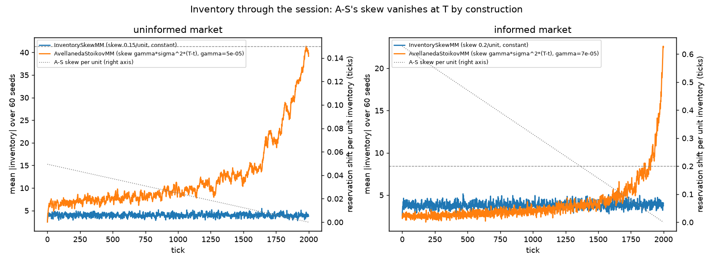
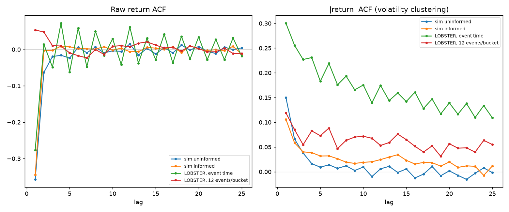
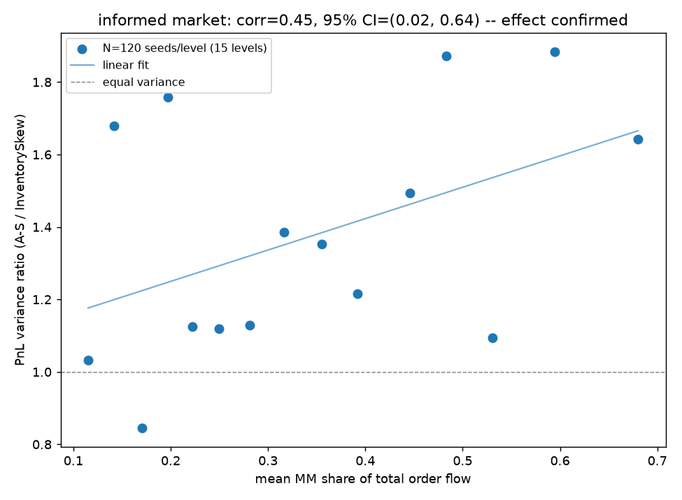

# LOB Simulator

A limit order book matching engine, an agent-based market built on top of it,
and a market-making study run inside that market.

The engine matches limit and market orders by price-time priority with
self-trade prevention. A population of zero-intelligence noise traders makes
the market. Two versions of that market are used: an **uninformed** one, where
nobody knows anything and no fill is ever adversely selected, and an
**informed** one, where the noise anchors to a diffusing fundamental value and
one trader with a one-tick information edge picks off stale quotes. Three
market makers are dropped into each, one at a time, and compared over 500
matched seeds: a constant-spread quoter, an inventory-skew heuristic, and
Avellaneda-Stoikov (2008). The noise market is checked against real LOBSTER
data, on a matched clock, before any strategy result is read.

## Quick start

```bash
uv sync --extra dev
```

```bash
uv run pytest -q
```

```bash
uv run mypy src/lob_simulator tests
```

```bash
uv run ruff check .
```

243 tests, about 5 minutes. mypy runs strict and
clean. All three gates run in CI (`.github/workflows/ci.yml`) on Linux and
Windows, Python 3.11 and 3.14.

Reproduce the results end to end, in this order (later scripts read the
sweep's chosen gamma and skew_k from `results/`, and every script that
builds an A-S agent calibrates on the same seed):

```bash
uv run python scripts/run_zi_check.py                        # market emergence + plot
uv run python scripts/run_calibration.py                     # sigma (1- and 50-tick), A, k -> results/calibration.json
uv run python scripts/run_gamma_sweep.py --market uninformed # picks gamma and skew_k (~20 min)
uv run python scripts/run_gamma_sweep.py --market informed   # picks gamma and skew_k (~20 min)
uv run python scripts/run_monte_carlo.py --market uninformed # 500-seed comparison (~20 min)
uv run python scripts/run_monte_carlo.py --market informed   # 500-seed comparison (~20 min)
uv run python scripts/run_inventory_path.py                  # |inventory| through the session (~4 min)
uv run python scripts/fetch_lobster_sample.py                # ~7.6 MB of real AAPL data
uv run python scripts/run_stylized_facts.py                  # simulated vs real, matched clock
uv run python scripts/run_market_impact.py                   # market-share sweep (~40 min)
```

Every number in a Results table below comes from a JSON in `results/`
written by one of these scripts.

## Layout

```
src/lob_simulator/   engine, agents, market builder, research code
scripts/             one script per reported result; each writes into results/
tests/               unit, integration, and Hypothesis property tests
data/lobster/        real LOBSTER sample, fetched on demand, never committed
results/             committed figures and JSON summaries
```

## Architecture

Built in the dependency order below; each module imports only from modules
above it.

```
types.py                     Order (mutable), Trade (frozen), Place/Cancel intents
book.py                      OrderBook: heaps + a liveness dict, matching, self-trade
                             prevention, IOC remainders
mark.py                      resolve_mark(): mid, then last trade, then reference price
agent.py                     Agent base (cash, inventory, pnl) + Snapshot/OrderView
engine.py                    Engine: tick loop, settlement, per-tick logs, event count
logs.py, export.py           log entry types, and DataFrame/Parquet export
seeding.py                   spawn_rngs(): one master seed, many reproducible streams
fundamental.py               FundamentalValue: lazily generated jump random walk
agents/zero_intelligence.py  ZeroIntelligenceAgent: noise trader anchored to a
                             reference price or to the fundamental
agents/informed.py           InformedTrader: knows next tick's fundamental, takes
                             every quote on the wrong side of it
agents/quoting.py            QuotingAgent base (floor/ceil quote snapping) + NaiveMM,
                             InventorySkewMM, AvellanedaStoikovMM
market.py                    MarketSpec + build_market(): UNINFORMED and INFORMED,
                             the one place a background market is assembled
calibration.py               rolling volatility in price or log units;
                             lambda(delta) = A*exp(-k*delta) fit; calibrate()
research/monte_carlo.py      batch runner, terminal-PnL rule, fill markouts,
                             bootstrap CIs
research/inventory_path.py   |inventory| at every tick, across seeds
research/gamma_sweep.py      gamma chosen by a stated rule on stated seeds
research/stylized_facts.py   kurtosis, ACF, order-flow imbalance; takes plain arrays
research/lobster.py          loads a real LOBSTER sample; resamples event time to
                             the simulator's tick clock
research/market_impact.py    MM-share sweep + bootstrapped correlation CI
```

Two engine details worth knowing before reading `book.py`:

**Liveness is dict membership.** `OrderBook._orders` is the only record of
whether an order is live. `Order` carries no status field, so there is no
second account of liveness to keep in sync.

**Deletion is lazy.** Cancelling removes the order from that dict but leaves
its heap entry behind. Stale entries are skipped when they surface at the top
of a heap. A cancel is therefore O(1) rather than an O(n) heap scan, which
matters because a market maker re-quotes every tick. Stale entries do not
accumulate in practice: after 20,000 ticks with a re-quoting market maker the
two heaps hold about 3,700 entries for 38 live orders.

One quoting detail: quotes snap **outward** to the tick grid, bid floored and
ask ceilinged. Rounding to nearest would let a half-integer mark pull one side
a tick closer than the other, with Python's round-half-to-even choosing the
side by parity. An earlier version of this project did that; about half of
its NaiveMM quote pairs sat 1.5 ticks on one side of the mark and 2.5 on the
other.

## The two markets

Every strategy result below is run on one of two background markets, built
by `build_market()` from a `MarketSpec`.

**Uninformed.** 20 zero-intelligence agents, each active with probability 0.5
per tick, placing an order of 1-5 units at a uniform offset of up to 10 ticks
from a fixed reference price of 100, and cancelling each live order with
probability 0.1 per tick. Nobody has information; the mid is stationary noise
around 100 and never diffuses.

**Informed.** The same 20 agents, but anchored to a `FundamentalValue` that
starts at 1000 ticks and each tick, with probability 0.5, jumps by a uniform
1-4 ticks in a random direction. One `InformedTrader` reads the fundamental
one tick ahead and, whenever the mark is at least a tick away from it, places
a limit order at that value: it takes every quote priced on the wrong side of
where value is about to be and rests the remainder there. That is the
Glosten-Milgrom mechanism in its simplest form. The reference price is 1000
rather than 100 so a fundamental that wanders by tens of ticks over a session
stays far from the price floor; all economics are in ticks, so the level does
not otherwise matter.

What changes for a market maker between the two (NaiveMM, 500 seeds each,
from Result 4):

| | Uninformed | Informed |
|---|---:|---:|
| Markout of passive fills, 50 ticks later (ticks/unit) | +1.26 | +1.18 |
| Terminal PnL std | 735 | 10,397 |
| Mean / std of terminal PnL | 15.4 | 1.1 |

Fills in the informed market lose value after the fact, and the diffusing
fundamental turns inventory into real price risk. That second effect is the
larger one, and it is the problem Avellaneda-Stoikov is built for.

## Results

### 1. Does a market emerge?

30 zero-intelligence agents, 10,000 ticks, uninformed market:

| Check | Result |
|---|---|
| Two-sided fraction | 99.97% |
| Trades per 1k ticks | 9,581 |
| Spread | mean 4.24 ticks (first half 4.22, second half 4.25 — stationary) |
| Mark range | [90.5, 109.0], bounded by construction |
| Book depth | 36.5 live orders in the first half, 36.2 in the second: stable |



Depth is checked as explicitly as price. Price staying bounded is not enough:
a cancellation rule that removes at most one order per agent per tick leaves
live order count growing roughly linearly while price stays perfectly
well-behaved, which is just as degenerate. Cancelling each live order
independently with fixed probability holds depth at an equilibrium.

### 2. Calibration

Avellaneda-Stoikov takes three measured constants. Three points about what
is measured, two of which an earlier version of this project got wrong:

- **sigma is in price units.** The model's mid is an arithmetic Brownian
  motion `dS = sigma dW`, so sigma is the per-tick standard deviation of mark
  *differences*, in ticks. The log-return volatility that is conventional for
  describing a tape is a different number: at a price of 100 it is a hundredth
  of the price-unit one, at 1000 a thousandth. Feeding it to the formulas
  rescales `gamma * sigma^2` by the square of that factor, and a gamma chosen
  by sweeping absorbs the error silently. `estimate_sigma` defaults to price
  units and reports the log figure only for reference.
- **sigma is measured over 50 ticks, not one.** The one-tick sigma of a
  simulated mark is mostly bid-ask bounce: noise quotes arrive and cancel
  around an anchor, so the mark jitters by three ticks every tick whether or
  not the anchor moves. A-S's `sigma^2 (T - t)` is the variance the *anchor*
  accumulates, so the sigma it should be fed is the one implied by mark
  changes over many ticks, `std(m[t+h] - m[t]) / sqrt(h)`, once the bounce
  has averaged out. The table shows why h matters. On the informed market
  the estimate stops falling by h = 50 and lands on the fundamental's own
  per-tick std. On the uninformed market it never stops falling, because
  nothing diffuses: there is no right sigma, only less and less bounce.
  `calibrate` reports both figures; every A-S agent in `scripts/` is built
  with the 50-tick one (`Calibration.sigma_diffusive`). An earlier version
  fed A-S the one-tick figure, and the swept gamma absorbed the 1.5x error
  (Result 3 shows how exactly).
- **k is per tick of depth**, from fitting `lambda(delta) = A * exp(-k * delta)`
  to a probe quoter's fill rate at depths 1 to 12. Depth 15 was dropped from
  the grid: its expected fill count over a session is in the single digits,
  so a zero count (and a NaN fit) was a matter of which seed was drawn.

| | Uninformed | Informed |
|---|---:|---:|
| sigma, one tick, ticks per sqrt(tick), median over 10 seeds | 3.52 (CV 2.3%) | 3.27 (CV 2.6%) |
| sigma implied by 10-tick mark changes, median over the same seeds | 1.51 | 2.02 |
| sigma implied by 50-tick mark changes, median over the same seeds **(fed to A-S)** | 0.71 | 1.95 |
| sigma implied by 200-tick mark changes, median over the same seeds | 0.35 | 2.12 |
| fundamental's own per-tick std (analytic) | 0 (no fundamental) | 1.94 |
| same tape's one-tick log-return sigma | 0.0355 | 0.0028 |
| A, k (seed 999,999) | 5.49, 0.465 (R² 0.99) | 7.49, 0.547 (R² 0.98) |

Every script that needs these re-fits them on seed 999,999, disjoint from
its own trial seeds, rather than reading the numbers above; the A, k row is
that seed's fit. The constants the results below were run with are the
seed-999,999 values: uninformed sigma_diffusive 0.703 (one-tick 3.556),
informed sigma_diffusive 2.118 (one-tick 3.250). `scripts/run_calibration.py`
writes all of this, per seed and per horizon, to `results/calibration.json`.

### 3. Choosing gamma, and choosing skew_k the same way

gamma is the one A-S input that is not measured, and `skew_k` is the
inventory-skew heuristic's only parameter. Tuning one and hand-picking the
other makes any comparison between them a property of the tuning, so both
are swept by `scripts/run_gamma_sweep.py`, per market, on the same 60 seeds
(disjoint from the Monte Carlo's 500 and from the calibration seed) and
picked by the same rule: maximise mean terminal PnL over its standard
deviation. Fourteen gammas from 1e-7 to 1e-3, dense between 1e-5 and 3e-4
where the useful values fall; seven skew_k values from 0.02 to 0.5 ticks per
unit of inventory. NaiveMM runs on the same seeds as the fixed reference.

The two parameters are in different units, so each A-S row also shows what
gamma buys in the heuristic's unit: the reservation shift per unit of
inventory at the open, `gamma * sigma^2 * T`, which decays linearly to zero
at T (its time average is half the open value). The heuristic's shift is
constant.

Uninformed market (sigma_diffusive 0.703, k 0.465; chosen gamma 5e-05, chosen skew_k 0.15):

| A-S by gamma | Skew/unit at open | Mean PnL | PnL std | Mean/std | Mean &#124;inv&#124;, mid | Mean &#124;inv&#124;, T | Markout |
|---|---:|---:|---:|---:|---:|---:|---:|
| NaiveMM (reference) | 0 | 11,180 | 609 | 18.4 | 89.6 | 132.3 | +1.25 |
| gamma 1e-07 | 0.00 | 11,284 | 820 | 13.8 | 86.4 | 118.8 | +1.45 |
| gamma 3e-07 | 0.00 | 11,284 | 820 | 13.8 | 86.4 | 118.8 | +1.45 |
| gamma 1e-06 | 0.00 | 11,277 | 750 | 15.0 | 82.2 | 116.1 | +1.45 |
| gamma 3e-06 | 0.00 | 11,155 | 669 | 16.7 | 59.0 | 108.0 | +1.44 |
| gamma 1e-05 | 0.01 | 11,142 | 608 | 18.3 | 25.5 | 66.5 | +1.42 |
| gamma 2e-05 | 0.02 | 11,116 | 586 | 19.0 | 16.4 | 59.5 | +1.41 |
| gamma 3e-05 | 0.03 | 11,180 | 616 | 18.2 | 12.8 | 42.7 | +1.42 |
| gamma 5e-05 **(chosen)** | 0.05 | 11,202 | 457 | 24.5 | 9.8 | 33.9 | +1.41 |
| gamma 7e-05 | 0.07 | 10,874 | 452 | 24.0 | 8.1 | 36.3 | +1.39 |
| gamma 0.0001 | 0.10 | 10,773 | 500 | 21.6 | 6.8 | 31.1 | +1.37 |
| gamma 0.00015 | 0.15 | 10,627 | 441 | 24.1 | 5.7 | 26.5 | +1.36 |
| gamma 0.0002 | 0.20 | 10,474 | 442 | 23.7 | 4.9 | 27.5 | +1.34 |
| gamma 0.0003 | 0.30 | 9,819 | 495 | 19.8 | 4.1 | 22.4 | +1.28 |
| gamma 0.001 | 0.99 | 6,704 | 572 | 11.7 | 2.7 | 14.1 | +0.97 |

| InventorySkewMM by skew_k | Skew/unit (constant) | Mean PnL | PnL std | Mean/std | Mean &#124;inv&#124;, mid | Mean &#124;inv&#124;, T | Markout |
|---|---:|---:|---:|---:|---:|---:|---:|
| skew_k 0.02 | 0.02 | 10,915 | 523 | 20.9 | 10.7 | 10.3 | +1.30 |
| skew_k 0.05 | 0.05 | 10,808 | 558 | 19.4 | 6.6 | 5.7 | +1.31 |
| skew_k 0.1 | 0.10 | 10,128 | 447 | 22.6 | 4.7 | 5.3 | +1.21 |
| skew_k 0.15 **(chosen)** | 0.15 | 9,597 | 365 | 26.3 | 4.0 | 4.1 | +1.16 |
| skew_k 0.2 | 0.20 | 8,960 | 480 | 18.7 | 3.5 | 3.6 | +1.07 |
| skew_k 0.3 | 0.30 | 7,847 | 441 | 17.8 | 3.1 | 2.9 | +0.93 |
| skew_k 0.5 | 0.50 | 5,113 | 424 | 12.0 | 2.6 | 2.5 | +0.66 |

Informed market (sigma_diffusive 2.118, k 0.547; chosen gamma 7e-05, chosen skew_k 0.2):

| A-S by gamma | Skew/unit at open | Mean PnL | PnL std | Mean/std | Mean &#124;inv&#124;, mid | Mean &#124;inv&#124;, T | Markout |
|---|---:|---:|---:|---:|---:|---:|---:|
| NaiveMM (reference) | 0 | 10,340 | 14,644 | 0.7 | 113.7 | 144.2 | +1.20 |
| gamma 1e-07 | 0.00 | 10,539 | 13,731 | 0.8 | 109.3 | 134.2 | +1.19 |
| gamma 3e-07 | 0.00 | 12,611 | 8,020 | 1.6 | 68.6 | 90.3 | +1.16 |
| gamma 1e-06 | 0.01 | 11,051 | 4,542 | 2.4 | 30.5 | 85.7 | +1.16 |
| gamma 3e-06 | 0.03 | 11,441 | 2,426 | 4.7 | 15.9 | 59.6 | +1.19 |
| gamma 1e-05 | 0.09 | 11,248 | 1,281 | 8.8 | 7.9 | 29.4 | +1.20 |
| gamma 2e-05 | 0.18 | 11,257 | 935 | 12.0 | 5.7 | 33.4 | +1.19 |
| gamma 3e-05 | 0.27 | 11,095 | 926 | 12.0 | 4.7 | 26.9 | +1.18 |
| gamma 5e-05 | 0.45 | 10,517 | 839 | 12.5 | 3.7 | 23.4 | +1.14 |
| gamma 7e-05 **(chosen)** | 0.63 | 10,026 | 637 | 15.7 | 3.2 | 18.8 | +1.11 |
| gamma 0.0001 | 0.90 | 8,985 | 709 | 12.7 | 2.8 | 15.8 | +1.05 |
| gamma 0.00015 | 1.35 | 6,796 | 556 | 12.2 | 2.5 | 16.8 | +0.90 |
| gamma 0.0002 | 1.79 | 4,666 | 612 | 7.6 | 2.4 | 12.0 | +0.77 |
| gamma 0.0003 | 2.69 | 288 | 703 | 0.4 | 2.3 | 10.6 | +0.45 |
| gamma 0.001 | 8.97 | -19,671 | 807 | -24.4 | 2.4 | 9.3 | -0.66 |

| InventorySkewMM by skew_k | Skew/unit (constant) | Mean PnL | PnL std | Mean/std | Mean &#124;inv&#124;, mid | Mean &#124;inv&#124;, T | Markout |
|---|---:|---:|---:|---:|---:|---:|---:|
| skew_k 0.02 | 0.02 | 11,624 | 1,594 | 7.3 | 12.5 | 13.2 | +1.28 |
| skew_k 0.05 | 0.05 | 11,666 | 1,027 | 11.4 | 7.4 | 6.6 | +1.27 |
| skew_k 0.1 | 0.10 | 11,412 | 574 | 19.9 | 5.3 | 4.9 | +1.24 |
| skew_k 0.15 | 0.15 | 11,231 | 712 | 15.8 | 4.3 | 4.4 | +1.24 |
| skew_k 0.2 **(chosen)** | 0.20 | 10,907 | 523 | 20.8 | 3.8 | 4.2 | +1.18 |
| skew_k 0.3 | 0.30 | 10,186 | 531 | 19.2 | 3.2 | 3.5 | +1.10 |
| skew_k 0.5 | 0.50 | 7,761 | 467 | 16.6 | 2.7 | 2.8 | +0.86 |



Four things to read off these tables.

**The old gamma had absorbed the sigma error exactly.** An earlier version
fed A-S the one-tick sigma (3.25) and the sweep chose gamma 3e-5, a
reservation shift of 0.63 ticks per unit at the open. With the diffusive
sigma (2.12) the sweep chooses 7e-5: 0.63 ticks per unit at the open. The
agent's behaviour is unchanged; what changed is that gamma now multiplies
the variance the fundamental actually accumulates, so it can be read as a
risk aversion rather than as a fudge factor on a mis-measured variance.

**Past about a tick per unit the agent breaks.** One 5-unit fill shifts the
reservation by five ticks or more, the far-side quote goes through the mid,
and the agent sells below fair value to get flat: mean PnL collapses and
markout goes negative from gamma 3e-4 on the informed market. The chosen
values sit where PnL dispersion bottoms out before that happens. Because
the choice is by a stated rule on held-out seeds, it is a fit, not a
derivation from an independent risk-aversion argument.

**On the uninformed market A-S is a spread quoter with a small lean.** The
chosen gamma gives 0.05 ticks per unit at the open, decaying to zero.
Below gamma 3e-6 the shift is under 0.003 ticks per unit and the quotes are
identical to NaiveMM's after tick snapping (the 1e-7 and 3e-7 rows are the
same run). The "variance" this gamma is averse to is residual bounce, 0.70
ticks per sqrt(tick) at h = 50 and still falling at h = 200 (Result 2),
because nothing on this market diffuses; gamma has no risk interpretation
here and the uninformed comparison in Result 4a is a spread-width
comparison, as it says.

**Tuned the same way, the constant skew matches or beats A-S.** On the
informed market the rule picks skew_k 0.2 with mean over std 20.8 against
A-S's best 15.7. At skew_k 0.1 the heuristic dominates A-S outright: higher
mean (11,412 vs 10,026), lower std (574 vs 637), and a quarter of the
terminal inventory (4.9 vs 18.8). On the uninformed market the rule picks
0.15 with 26.3 against A-S's 24.5. This does not make A-S wrong. Its skew at
the chosen gamma runs from 0.63 at the open to zero at T, with a time
average of 0.32, inside the band where the constant skew does best. It
means this market is not one where a time-varying skew earns anything over
a constant one, which is a clean finding. What cannot stand is the earlier
framing, on a comparison against a hand-picked skew_k of 0.05, that A-S
wins on variance. Result 4 runs the fair comparison on 500 seeds.

### 4. Naive vs inventory-skew vs Avellaneda-Stoikov

500 seeds per strategy, matched, 2000-tick sessions, with gamma and skew_k
from Result 3 and A-S fed the diffusive sigma. Terminal PnL is measured at
the last tick where the book was two-sided, so the mark is a mid rather than
a stale last-trade price. 95% bootstrapped CIs. Markout is the mean per-unit
gap between the mark 50 ticks after each passive fill and the fill price;
negative means fills were adversely selected. Passive units are filled on
the strategy's own quotes; aggressor units are filled by crossing the spread.

**4a. Uninformed market** (gamma 5e-05, skew_k 0.15). This is a spread-width
comparison under uninformed flow, not a risk-management comparison: no fill
ever loses value, so whoever quotes tighter and fills more wins on mean, and
the only risk is mark-to-market noise on whatever inventory has accumulated.

| Strategy | Mean PnL | 95% CI | PnL std | Mean/std | Mean &#124;inventory&#124; | Fills | Passive units | Aggressor units | Markout, 50 ticks |
|---|---:|---:|---:|---:|---:|---:|---:|---:|---:|
| NaiveMM | 11,353 | (11,290, 11,420) | 735 | 15.4 | 129.7 | 3,881 | 9,009 | 0.3 | +1.26 |
| InventorySkewMM | 9,633 | (9,590, 9,672) | 490 | 19.7 | 3.9 | 3,593 | 8,342 | 1.6 | +1.15 |
| AvellanedaStoikovMM | 11,088 | (11,039, 11,139) | 573 | 19.3 | 39.5 | 3,412 | 7,851 | 0.2 | +1.41 |

The heuristic's swept skew_k of 0.15 buys the lowest std and the tightest
inventory with 1,700 of mean PnL; A-S at its swept gamma leans so little
(0.05 ticks per unit at the open) that it is NaiveMM with a slightly wider
quote and a slow drift back to flat. On mean over std the two are tied.

**4b. Informed market** (gamma 7e-05, skew_k 0.2). The comparison the
strategies were built for.

| Strategy | Mean PnL | 95% CI | PnL std | Mean/std | Mean &#124;inventory&#124; | Fills | Passive units | Aggressor units | Markout, 50 ticks |
|---|---:|---:|---:|---:|---:|---:|---:|---:|---:|
| NaiveMM | 11,574 | (10,612, 12,452) | 10,397 | 1.1 | 138.5 | 4,098 | 9,710 | 1.0 | +1.18 |
| InventorySkewMM | 10,936 | (10,887, 10,987) | 584 | 18.7 | 3.6 | 3,879 | 9,205 | 20.5 | +1.19 |
| AvellanedaStoikovMM | 9,969 | (9,909, 10,028) | 686 | 14.5 | 21.1 | 3,860 | 9,038 | 178.5 | +1.11 |

Passive fills split by who took the other side:

| Strategy | Share of passive units vs the informed trader | Markout vs informed | Markout vs noise | Markout, all |
|---|---:|---:|---:|---:|
| NaiveMM | 12.0% | -1.40 | +1.53 | +1.18 |
| InventorySkewMM | 12.0% | -1.39 | +1.54 | +1.19 |
| AvellanedaStoikovMM | 11.8% | -1.44 | +1.45 | +1.11 |



Three things to read off the informed-market tables:

- **The naive quoter is no longer safe.** Its mean PnL is unchanged from the
  uninformed market but its standard deviation is 14x larger (10,397 against
  735), with a 5th percentile below zero. An inventory of 139 units against
  a mid that diffuses by tens of ticks is the whole story.
- **Adverse selection is large and masked, not small.** The aggregate
  markout (+1.18 against +1.26 uninformed) says the informed trader barely
  touches the market maker. The split says otherwise: 12% of NaiveMM's
  passive volume is taken by the informed trader and loses 1.4 ticks per
  unit, so on those fills the market maker gives back the whole 2-tick
  half-spread plus most of another tick. Relative to what the same units
  earn against noise, that is about 3 ticks per unit, roughly 3,400 ticks
  a session against a mean PnL of 11,574. It is invisible in the aggregate
  because the *noise* fills earn 0.3 ticks per unit more than in the
  uninformed market (+1.53 against +1.26): after a jump the market maker's
  quote on the favourable side is stale in its own favour, and
  zero-intelligence noise with a uniform +-10 offset lifts it at a price far
  through value. The informed-trader loss and that windfall offset, which
  is why mean PnL is flat across the two markets. A Glosten-Milgrom market
  with 12% informed volume would lower the uninformed market maker's mean;
  this one does not only because its noise is more generous than real noise.
  All three strategies see the same split, within 0.2% of share and 0.1
  tick of markout: the skew controls inventory, it does not dodge the
  informed trader.
- **Tuned the same way, a constant skew beats A-S here.** The heuristic at
  its swept skew_k of 0.2 has the higher mean (10,936 against 9,969,
  non-overlapping CIs), the lower std (584 against 686), the better mean
  over std (18.7 against 14.5) and a sixth of the terminal inventory (3.6
  against 21.1). Both remove almost all of NaiveMM's risk; A-S pays about
  9% of the heuristic's mean PnL for a wider distribution. Part of why:
  at the chosen gamma the reservation shift is 0.63 ticks per unit at the
  open, so one 5-unit fill moves the far quote 3 ticks and through the mid,
  and A-S fills 178 units a session as aggressor (the heuristic 20, NaiveMM
  1). That is how it holds mid-session inventory at 2 to 3 units (Result
  5), and it is a cost, not an edge. The optimal-spread term is inert:
  `2/k = 3.66` ticks, half 1.83, snaps outward to the same bid and ask as
  NaiveMM's 2.0 on every mark, so the whole comparison is a comparison of
  reservation skews, and on this market a constant 0.1 to 0.2 ticks per
  unit does what A-S's time-varying one does with no calibration, no
  horizon and no end-of-session inventory release. An earlier version of
  this section, comparing against a hand-picked skew_k of 0.05, led with
  A-S having the lowest std of the three; that ordering was a property of
  tuning one strategy and not the other.

A-S's mean |terminal inventory| of 21.1 against the heuristic's 3.6 is the
observation the next result explains.

### 5. Inventory through the session, not just at its end

A-S's inventory skew is `gamma * sigma^2 * (T - t)` per unit held: largest at
the open and exactly zero at the horizon, by construction. The constant-skew
heuristic shifts its quotes by a fixed amount per unit throughout, 0.2 ticks
on the informed market and 0.15 on the uninformed one (the swept values from
Result 3). Judging the two on *terminal* inventory alone therefore judges
A-S at the one tick where it is built to stop caring, and an earlier version
of this project did exactly that, then spent a 40-minute experiment
(Result 7) looking for an explanation elsewhere.

Mean |inventory| over 60 seeds:

| t | 250 | 500 | 1000 | 1500 | 1800 | 1900 | 1999 |
|---|---:|---:|---:|---:|---:|---:|---:|
| **informed market** (gamma 7e-05, skew_k 0.2) |  |  |  |  |  |  |  |
| InventorySkewMM mean &#124;inv&#124; | 3.2 | 3.5 | 4.0 | 3.9 | 3.7 | 3.3 | 3.7 |
| A-S mean &#124;inv&#124; | 2.6 | 2.6 | 3.0 | 4.4 | 7.9 | 8.0 | 22.6 |
| A-S skew per unit (ticks) | 0.550 | 0.471 | 0.314 | 0.157 | 0.063 | 0.031 | 0.000 |
| InventorySkewMM skew per unit (ticks) | 0.200 | 0.200 | 0.200 | 0.200 | 0.200 | 0.200 | 0.200 |
| **uninformed market** (gamma 5e-05, skew_k 0.15) |  |  |  |  |  |  |  |
| InventorySkewMM mean &#124;inv&#124; | 4.3 | 3.7 | 3.8 | 4.4 | 4.4 | 4.4 | 3.8 |
| A-S mean &#124;inv&#124; | 6.9 | 7.7 | 9.3 | 12.0 | 25.3 | 32.7 | 39.1 |
| A-S skew per unit (ticks) | 0.043 | 0.037 | 0.025 | 0.012 | 0.005 | 0.002 | 0.000 |
| InventorySkewMM skew per unit (ticks) | 0.150 | 0.150 | 0.150 | 0.150 | 0.150 | 0.150 | 0.150 |



On the informed market A-S holds inventory at 2.6 to 3.0 units for the first
half of the session, a little under the heuristic's 3.2 to 4.0 (3.2 against
3.8 over the middle half), and lets it go in the last 500 ticks as its skew
per unit drops below the heuristic's constant 0.2: 4.4 at t=1500, 7.9 at
t=1800, 22.6 at t=1999. Terminal inventory is measured at the one point
where A-S is weakest. That is the whole explanation for the "A-S ends looser
than the heuristic" observation, and it is a property of the formula, not of
the market. With both parameters tuned the mid-session gap is small; the
earlier version's factor-of-two gap was against an under-tuned skew_k of
0.05.

On the uninformed market the swept gamma is so small (there is no diffusion
to be averse to) that A-S's skew never exceeds 0.043 ticks per unit, below
the heuristic's 0.15 from the first tick, so A-S is looser than the
heuristic throughout (9.7 against 4.0 over the middle half) and the terminal
gap is just the same decay from a higher start.

### 6. Stylized facts: simulated tape vs LOBSTER, on a matched clock

Real data: LOBSTER's free AAPL sample, 2012-06-21, top of book, ~118k events.

LOBSTER is in *event* time, one row per order-book message, and 46% of its
consecutive mid changes are exactly zero. The simulator logs one mark per
*tick*, after all of that tick's intents have been applied. Comparing the two
without aligning the clocks compares the clocks, not the markets: the
zero-return mass alone inflates event-time kurtosis and every
autocorrelation. So the real tape is resampled into buckets of as many events
as one simulated tick applies (12, measured from the engine's intent count),
taking each bucket's last mid and net signed volume, which is what a tick
records.

| Statistic | Sim, uninformed | Sim, informed | LOBSTER, event time | LOBSTER, 12 events/bucket |
|---|---:|---:|---:|---:|
| Observations | 19,999 | 19,999 | 118,496 | 9,873 |
| Pearson kurtosis (>3 = fat tails) | 3.59 | 3.60 | 17.85 | 4.80 |
| Return ACF, lag 1 | -0.357 | -0.345 | -0.276 | +0.053 |
| Return ACF, mean lag 2+ | -0.006 | 0.001 | 0.003 | 0.003 |
| &#124;Return&#124; ACF, lag 1 | 0.150 | 0.106 | 0.300 | 0.119 |
| &#124;Return&#124; ACF, lag 20 | -0.002 | 0.011 | 0.109 | 0.055 |
| OFI vs subsequent price change | 0.064 | 0.049 | 0.176 | -0.006 |



Read against the matched-clock column:

- **Fat tails: direction yes, magnitude no.** Both simulated tapes sit just
  above 3; the real one at 4.8. The jump fundamental adds nothing here
  because the noise flow re-anchors within the tick.
- **Bid-ask bounce: the earlier "match" was an event-time artifact.** The
  real tape's lag-1 autocorrelation is -0.28 per event and +0.05 per bucket.
  The simulator's -0.36 per tick is a genuine feature of its own clock, in
  which one tick contains a whole round of order arrivals against a book that
  then mean-reverts to the anchor, and it does not correspond to anything in
  the real tape sampled the same way.
- **Volatility clustering: absent in the simulation, present in the data,
  on any clock.** Real |return| autocorrelation is still 0.055 at lag 20
  after resampling; simulated is at zero by lag 10. This is the one
  conclusion that survives every sampling choice, and it follows from the
  agent population: a memoryless noise trader has no mechanism for
  persistence in volatility.
- **Order-flow imbalance: no match once clocks align.** The signed-volume
  proxy predicts nothing at bucket scale in the real tape.

### 7. Does A-S's edge depend on its own market share?

Avellaneda-Stoikov is derived under an exogenous Brownian mid-price; here the
mid is endogenous. This experiment asks whether A-S's PnL variance relative
to InventorySkewMM's changes as the MM's share of order flow grows, by
varying the noise-agent count across 15 levels with 120 matched seeds each,
on the informed market, and correlating the A-S/Skew variance ratio against
measured MM share (a share of trade count). Both strategies use their swept
parameters (gamma 7e-05, skew_k 0.2) and A-S the diffusive sigma. The CI
bootstraps which seeds contribute, applied at every level simultaneously,
over 3,000 replicates.

| MM share | 0.68 | 0.59 | 0.53 | 0.48 | 0.45 | 0.39 | 0.36 | 0.32 | 0.28 | 0.25 | 0.22 | 0.20 | 0.17 | 0.14 | 0.12 |
|---|---:|---:|---:|---:|---:|---:|---:|---:|---:|---:|---:|---:|---:|---:|---:|
| Variance ratio (A-S/Skew) | 1.64 | 1.88 | 1.09 | 1.87 | 1.49 | 1.22 | 1.35 | 1.39 | 1.13 | 1.12 | 1.13 | 1.76 | 0.85 | 1.68 | 1.03 |

correlation(share, ratio) = **+0.453**, 95% CI = **(0.018, 0.640)**.



Two readings, and the second matters more than the first.

The formal test comes out positive: the CI excludes zero, so A-S's variance
relative to the tuned heuristic rises with A-S's share of the market. Read
with the ratios themselves, that is a weak result. The ratio is above 1 at
14 of 15 levels (A-S is the wider distribution against the tuned heuristic
almost everywhere, consistent with Result 4b), but it jumps between 0.85 and
1.88 with no monotone trend, and the lower CI bound clears zero by 0.02.
Three of the fifteen points carry the correlation.

The reading that matters is what happened when the comparator changed. An
earlier version of this experiment compared A-S against the hand-picked
skew_k of 0.05 and found the ratio between 0.38 and 0.76 at every level with
a correlation of -0.38 and a CI spanning zero: A-S's variance advantage
"holds at every level" and does not trend with share. Tuning the heuristic
by the same rule as A-S turns the advantage into a deficit at nearly every
level and flips the sign of the trend. Nothing about A-S changed. The
experiment is therefore mostly a measurement of the comparator, and the
honest conclusion is that a 15-point correlation of a variance ratio against
an untuned baseline does not carry a finding about endogenous price
formation either way.

This experiment was originally run to explain why the constant-skew
heuristic held tighter *terminal* inventory than A-S. Result 5 answers that
directly: the horizon term, not endogenous price formation. Note also the
confound: sigma and k are calibrated at 20 noise agents and held fixed
across the sweep, while the market's own one-tick sigma moves from about
5.4 ticks at 2 agents to 2.9 at 80, so at the extremes A-S is running on
the wrong sigma as well as at a different share.

## Limitations

- **No queue position.** Fills follow price-time priority at the book level.
  There is no model of where in a price level's queue an order sits beyond
  id-order tie-breaking, and no partial-queue adverse selection.
- **No latency, and the market maker always acts first.** Agents act
  synchronously within a tick in construction order, with the subject
  strategy first. It re-quotes before any of that tick's noise arrives and is
  never raced for queue position; the informed trader's edge is exactly one
  tick of lookahead against quotes set off the current mid.
- **Noise re-anchors to the fundamental instantly, and pays the market maker
  for it.** In the informed market the zero-intelligence agents centre on the
  current fundamental, so price discovery is immediate and the only stale
  quotes are the market maker's. Real noise flow does not know the
  fundamental. The flip side is that this noise lifts the market maker's
  stale quote on the *favourable* side at prices far through value, which
  is the windfall that offsets the informed trader's toll in Result 4b. In
  a market whose noise did not know the fundamental, 12% informed volume at
  -1.4 ticks per unit would show up in mean PnL.
- **Adverse selection is concentrated, not modest.** The informed trader
  takes 12% of the market maker's passive volume and each of those units
  loses about 1.4 ticks at a 50-tick horizon: the whole half-spread and
  more. None of the three strategies changes that share or that loss; the
  inventory skews manage inventory risk, they do not dodge the informed
  trader. An earlier version of this section called adverse selection
  "modest" from the aggregate markout, which is what the noise windfall
  above made it look like.
- **sigma at a one-tick horizon is mostly bounce; A-S is now fed the 50-tick
  figure.** The one-tick price-unit sigma (3.3 ticks per sqrt(tick) on the
  informed market) is dominated by tick-to-tick noise around the anchor;
  the fundamental moves 1.9. A-S is built with the sigma implied by 50-tick
  mark changes (2.1), which makes gamma a multiplier on the variance that
  actually accrues. On the uninformed market that figure (0.7) is still
  falling at longer horizons because nothing diffuses, so there gamma has
  no risk interpretation and A-S is a spread quoter with a small lean.
- **gamma and skew_k are fitted, not derived.** Both sweeps' rule is stated
  and their seeds are held out, but each value is the one that did best on
  this market, not an independent risk aversion. Results 4, 5 and 7 are
  conditional on them. The two are at least fitted the same way on the same
  seeds, which the earlier comparison against a hand-picked skew_k was not.
- **"Matched seeds" match the fundamental path, not the noise.** One master
  seed gives every agent and the fundamental its own stream, so two
  strategies on the same seed face the same fundamental path. But
  zero-intelligence cancels are drawn per live order, so the noise streams
  diverge as soon as the subject changes the live-order count, which is
  immediately. Common random numbers are therefore partial: the paired
  comparison controls for the fundamental, not for the order flow.
- **Terminal PnL is one tick's mark.** Fixing the measurement tick makes
  strategies comparable, but that mark is a single mid rather than, say, a
  closing VWAP, so it carries tick-level noise.
- **Single asset.** No cross-asset effects, correlated order flow, or
  portfolio risk.
- **Calibration is exogenous; deployment is endogenous.** Sigma and k are fit
  on a market with no market maker in it. The comparison then runs an A-S
  agent parameterized by those constants inside a market that agent changes.
- **Order-flow imbalance is a signed-volume proxy**, not the depth-based
  definition of Cont, Kukanov & Stoikov. The engine does not model queue sizes
  beyond best bid and ask, so the fuller measure was not available. The
  market share in Result 7 is likewise a share of *trade count*, not of
  volume.
- **The real-data comparison is one day, one stock, top of book**, and the
  event-to-tick mapping is by event count, not clock time. LOBSTER's free
  sample is what is available without a data license.

## Reproducibility

One integer seed determines a whole run. `spawn_rngs()` derives one
independent `random.Random` stream per agent (and one for the fundamental)
from a master seed, and every id and sequence counter belongs to an
`OrderBook` instance rather than being process-global. Two runs built
identically from the same seed produce byte-identical Parquet exports, which
`tests/test_logging.py::TestExport::test_same_seed_exports_byte_identical_parquet`
checks directly. The fundamental's path is generated lazily and cached, so it
is the same whichever agent asks for it first and however far ahead.

## References

- Avellaneda, M., & Stoikov, S. (2008). *High-frequency trading in a limit
  order book.* Quantitative Finance, 8(3), 217-224. The reservation-price and
  optimal-spread formulas `AvellanedaStoikovMM` implements.
- Glosten, L. R., & Milgrom, P. R. (1985). *Bid, ask and transaction prices in
  a specialist market with heterogeneously informed traders.* Journal of
  Financial Economics, 14(1), 71-100. The adverse-selection mechanism
  `InformedTrader` is the simplest version of.
- Gode, D. K., & Sunder, S. (1993). *Allocative efficiency of markets with
  zero-intelligence traders.* Journal of Political Economy, 101(1), 119-137.
  The zero-intelligence trader `ZeroIntelligenceAgent` is based on.
- Cont, R., Kukanov, A., & Stoikov, S. (2014). *The price impact of order book
  events.* Journal of Financial Econometrics, 12(1), 47-88. The depth-based
  order-flow-imbalance definition this project approximates with signed trade
  volume.
- Huang, R., & Polak, T. (2011). *LOBSTER: Limit Order Book Reconstruction
  System.* Source of the AAPL sample, mirrored on Hugging Face
  (`totalorganfailure/lobster-data`).
