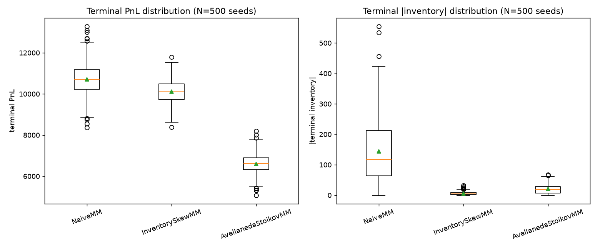

# LOB Simulator

A limit order book matching engine, an agent-based market built on top of it,
and a market-making study run inside that market.

The engine matches limit and market orders by price-time priority with
self-trade prevention. A population of zero-intelligence noise traders makes
the market; three market makers are then dropped into it one at a time — a
constant-spread quoter, an inventory-skew heuristic, and Avellaneda-Stoikov
(2008) — and compared over 500 matched seeds. The noise market is checked
against real LOBSTER data before any strategy result is read.

## Quick start

```bash
uv sync --extra dev
```

```bash
uv run pytest -q
```

```bash
uv run mypy src/lob_simulator tests
```

```bash
uv run ruff check .
```

143 tests, about 2 minutes. mypy runs strict and clean. All three gates run in
CI (`.github/workflows/ci.yml`) on Linux and Windows, Python 3.11 and 3.14.

Reproduce the results end to end:

```bash
uv run python scripts/run_zi_check.py          # market emergence + plot
uv run python scripts/run_calibration.py       # sigma, A, k
uv run python scripts/run_monte_carlo.py       # 500-seed strategy comparison (~13 min)
uv run python scripts/fetch_lobster_sample.py  # ~7.6 MB of real AAPL data
uv run python scripts/run_stylized_facts.py    # simulated vs real comparison
uv run python scripts/run_market_impact.py     # market-share sweep (~40 min)
```

## Layout

```
src/lob_simulator/   engine, agents, research code
scripts/             one script per reported result; each writes into results/
tests/               unit, integration, and Hypothesis property tests
data/lobster/        real LOBSTER sample, fetched on demand, never committed
results/             committed figures and JSON summaries
```

## Architecture

Built in the dependency order below; each module imports only from modules
above it.

```
types.py                     Order (mutable), Trade (frozen), Place/Cancel intents
book.py                      OrderBook: heaps + a liveness dict, matching, self-trade
                             prevention, IOC remainders
mark.py                      resolve_mark(): mid, then last trade, then reference price
agent.py                     Agent base (cash, inventory, pnl) + Snapshot/OrderView
engine.py                    Engine: tick loop, settlement, per-tick logs
logs.py, export.py           log entry types, and DataFrame/Parquet export
seeding.py                   spawn_rngs(): one master seed, many reproducible streams
agents/zero_intelligence.py  ZeroIntelligenceAgent: anchored, self-balancing noise trader
agents/quoting.py            QuotingAgent base + NaiveMM, InventorySkewMM,
                             AvellanedaStoikovMM
calibration.py               rolling volatility; lambda(delta) = A*exp(-k*delta) fit
research/monte_carlo.py      batch runner, terminal-PnL rule, bootstrap CIs
research/stylized_facts.py   kurtosis, ACF, order-flow imbalance; takes plain arrays
research/lobster.py          loads a real LOBSTER sample into the same arrays
research/market_impact.py    MM-share sweep + bootstrapped correlation CI
```

Two engine details worth knowing before reading `book.py`:

**Liveness is dict membership.** `OrderBook._orders` is the only record of
whether an order is live. `Order` carries no status field, so there is no
second account of liveness to keep in sync.

**Deletion is lazy.** Cancelling removes the order from that dict but leaves
its heap entry behind. Stale entries are skipped when they surface at the top
of a heap. A cancel is therefore O(1) rather than an O(n) heap scan, which
matters because a market maker re-quotes every tick.

## Results

### 1. Does a market emerge?

30 zero-intelligence agents, 10,000 ticks, anchored to `reference_price=100`:

| Check | Result |
|---|---|
| Two-sided fraction | 99.97% |
| Trades per 1k ticks | 9,597 |
| Spread | mean 4.23 ticks (first half 4.20, second half 4.26 — stationary) |
| Mark range | [90.00, 109.50], bounded by construction |
| Book depth | stable at ~30-40 live orders, not growing |


Depth is checked as explicitly as price. Price staying bounded is not enough:
a cancellation rule that removes at most one order per agent per tick leaves
live order count growing roughly linearly while price stays perfectly
well-behaved, which is just as degenerate. Cancelling each live order
independently with fixed probability holds depth at an equilibrium.

### 2. Calibration

Fitting `lambda(delta) = A * exp(-k * delta)` to a probe quoter's fill rate at
10 depths:

- **A = 7.01, k = 0.499**, R² = 0.98 (single-seed fits ranged 0.98-0.99)
- **sigma = 0.0355** per tick (rolling window 100), coefficient of variation
  2.3% across 10 seeds

Both are measured on this project's own simulated market, the same way the
Monte Carlo and the Avellaneda-Stoikov agent consume them.
`scripts/run_monte_carlo.py` re-fits them on a seed disjoint from its trial
seeds rather than reading these numbers back.

### 3. Naive vs inventory-skew vs Avellaneda-Stoikov

500 seeds per strategy, matched, 2000-tick sessions. Terminal PnL is measured
at the last tick where the book was two-sided, so the mark is a mid rather
than a stale last-trade price. 95% bootstrapped CIs:

| Strategy | Mean PnL | 95% CI | PnL std | Mean &#124;inventory&#124; |
|---|---:|---:|---:|---:|
| NaiveMM | 10,705.4 | (10,638.3, 10,767.4) | 732.9 | 144.5 |
| InventorySkewMM | 10,105.6 | (10,057.6, 10,153.7) | 535.5 | 6.1 |
| AvellanedaStoikovMM | 6,600.3 | (6,560.4, 6,640.2) | 458.7 | 20.4 |

`two_sided_tick_fraction = 1.000` for all three, so the measurement tick
existed in every trial.



The risk/return tradeoff is monotone across the three: as strategies get more
inventory-aware, PnL standard deviation falls (732.9 → 535.5 → 458.7) and so
does mean PnL (10,705 → 10,106 → 6,600). That reproduces Avellaneda-Stoikov's
own qualitative result — tighter inventory and lower PnL variance than a naive
quoter, paid for in mean PnL.

One result runs the other way. **InventorySkewMM holds tighter terminal
inventory than A-S** here (mean |inventory| 6.1 vs 20.4), on the dimension A-S
is supposed to dominate. Most of A-S's PnL shortfall against InventorySkew is
realized rather than unrealized (mean realized PnL 6,732 vs 10,145), so it is
giving up spread capture, not just holding a worse mark-to-market position.
Result 5 tests one explanation for this.

### 4. Stylized facts: simulated tape vs LOBSTER

Real data: LOBSTER's free AAPL sample, 2012-06-21, top of book, ~118k events.

| Statistic | Simulated | LOBSTER AAPL | Match |
|---|---:|---:|:--:|
| Pearson kurtosis (>3 = fat tails) | 3.586 | 17.848 | direction yes, magnitude no |
| Return ACF, lag 1 (bid-ask bounce) | -0.357 | -0.276 | yes |
| Return ACF, mean lag 2+ | -0.0058 | 0.0028 | yes (~0 both) |
| &#124;Return&#124; ACF, lag 1 | 0.150 | 0.300 | yes (positive both) |
| &#124;Return&#124; ACF, lag 20 | -0.002 | 0.109 | **no** |
| OFI vs subsequent price change | 0.064 | 0.176 | direction yes, magnitude no |


The mismatch is volatility clustering. Real |return| autocorrelation decays
slowly and is still clearly positive at lag 20; the simulated series is at ~0
by lag 10.

This follows from the agent population. Fat tails and the bid-ask bounce come
out of order-matching mechanics alone — a resting order absorbing a crossing
one mechanically anti-correlates consecutive returns, and occasional large
sweeps fatten the tails. Volatility clustering needs persistence across time:
agent memory, regime switching, or clustered order arrival. A population of
memoryless zero-intelligence traders has no mechanism to produce it.

### 5. Does A-S's edge erode as its own market impact grows?

Avellaneda-Stoikov is derived under an exogenous Brownian mid-price. The
formula has no term for the strategy's own effect on the mid. Here the mid is
always endogenous. If A-S's one clear advantage over InventorySkewMM — lower
PnL variance — depends on that exogeneity assumption, it should shrink as the
MM's share of order flow grows.

The MM's share is varied by varying the noise-agent count: fewer competitors
means the subject MM is a larger fraction of all trading. At each of 15 levels
(measured MM share 0.14 to 0.77), 120 matched seeds run both InventorySkewMM
and AvellanedaStoikovMM. The ratio of A-S PnL variance to InventorySkew PnL
variance is computed per level and correlated against measured MM share. The
CI comes from bootstrapping which seeds contribute, applied at every level
simultaneously, over 3,000 replicates.

| MM share | 0.77 | 0.66 | 0.59 | 0.54 | 0.51 | 0.46 | 0.43 | 0.39 | 0.35 | 0.32 | 0.28 | 0.25 | 0.21 | 0.17 | 0.14 |
|---|---:|---:|---:|---:|---:|---:|---:|---:|---:|---:|---:|---:|---:|---:|---:|
| Variance ratio (A-S/Skew) | 1.14 | 0.80 | 1.07 | 0.84 | 1.02 | 1.23 | 1.18 | 0.66 | 0.66 | 0.59 | 0.89 | 0.71 | 1.05 | 1.41 | 1.31 |

correlation(share, ratio) = **-0.088**, 95% CI = **(-0.377, 0.280)**.


The hypothesis is not supported. The CI includes zero and the points scatter
around a flat line. So why InventorySkewMM out-controls inventory against A-S
in this market is still open — endogenous price formation is not the
explanation.

## Limitations

- **No queue position.** Fills follow price-time priority at the book level.
  There is no model of where in a price level's queue an order sits beyond
  id-order tie-breaking, and no partial-queue adverse selection.
- **No latency.** Agents act synchronously within a tick. There is no race for
  queue position and no picking off stale quotes.
- **Fundamental value is a constant, not a process.** Zero-intelligence prices
  are anchored to a fixed `reference_price`, which keeps the market from
  drifting off but means there is no information-arrival process moving
  fundamental value over a session.
- **Terminal PnL is one tick's mark.** Fixing the measurement tick makes
  strategies comparable, but that mark is a single mid rather than, say, a
  closing VWAP, so it carries tick-level noise.
- **Single asset.** No cross-asset effects, correlated order flow, or
  portfolio risk.
- **`gamma = 0.2` was chosen by sweeping.** It was not derived from an
  independent risk-aversion argument, only picked as a value where the
  classical result reproduces without being pushed to an extreme. Results 3
  and 5 are conditional on it.
- **Calibration is exogenous; deployment is endogenous.** Sigma and k are fit
  on a market with no market maker in it. The comparison then runs an A-S
  agent parameterized by those constants inside a market that agent changes —
  tighter effective spread, some absorbed order flow. The calibration is never
  redone with the strategy present.
- **Order-flow imbalance is a signed-volume proxy**, not the depth-based
  definition of Cont, Kukanov & Stoikov. The engine does not model queue sizes
  beyond best bid and ask, so the fuller measure was not available.
- **The real-data comparison is one day, one stock, top of book.** LOBSTER's
  free sample is what is available without a data license, so this is a single
  external reference point rather than a broad benchmark.

## Reproducibility

One integer seed determines a whole run. `spawn_rngs()` derives one
independent `random.Random` stream per agent from a master seed, and every id
and sequence counter belongs to an `OrderBook` instance rather than being
process-global. Two runs built identically from the same seed produce
byte-identical Parquet exports, which
`tests/test_logging.py::TestExport::test_same_seed_exports_byte_identical_parquet`
checks directly.

## References

- Avellaneda, M., & Stoikov, S. (2008). *High-frequency trading in a limit
  order book.* Quantitative Finance, 8(3), 217-224. The reservation-price and
  optimal-spread formulas `AvellanedaStoikovMM` implements.
- Gode, D. K., & Sunder, S. (1993). *Allocative efficiency of markets with
  zero-intelligence traders.* Journal of Political Economy, 101(1), 119-137.
  The zero-intelligence trader `ZeroIntelligenceAgent` is based on.
- Cont, R., Kukanov, A., & Stoikov, S. (2014). *The price impact of order book
  events.* Journal of Financial Econometrics, 12(1), 47-88. The depth-based
  order-flow-imbalance definition this project approximates with signed trade
  volume.
- Huang, R., & Polak, T. (2011). *LOBSTER: Limit Order Book Reconstruction
  System.* Source of the AAPL sample, mirrored on Hugging Face
  (`totalorganfailure/lobster-data`).
